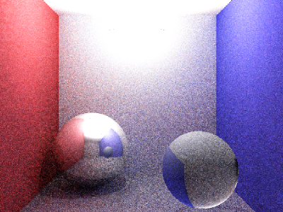

# Ray_compute
A simple path tracing, implemented with GLSL compute shader

## 1. SOURCES

Introduction to OpenGL compute shaders, by Anton Gerdelan: https://antongerdelan.net/opengl/compute.html

C++ path tracer, by Kevin Beason: https://www.kevinbeason.com/smallpt/

## 2. EXTERNAL DEPENDENCIES

All libraries are provided in the [libs](https://github.com/ludoBcg/libs) repository. 

External dependencies used for this project are:

* [GLEW (The OpenGL Extension Wrangler Library)](http://glew.sourceforge.net/)
  
* [GLM (OpenGL Mathematics)](https://github.com/g-truc/glm)

* [GLFW (Graphics Library Framework)](https://www.glfw.org/)

* [Dear ImGui (Immediate-mode Graphical User Interface)](https://github.com/ocornut/imgui)

* [LodePNG](https://lodev.org/lodepng/)  
